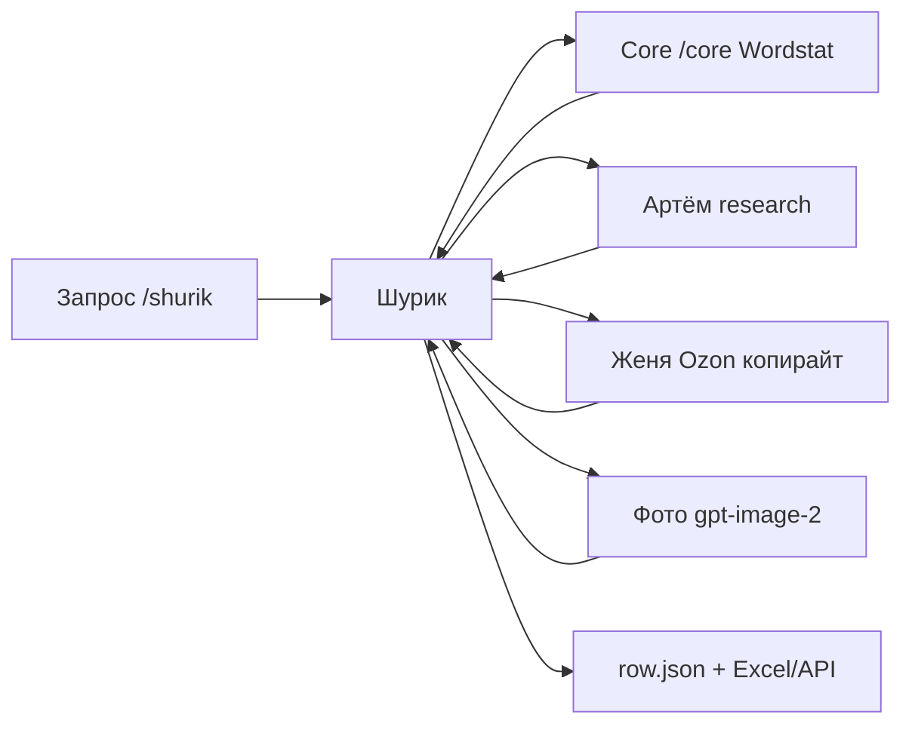

# Nero Network × ozon-mebel — какие агенты и зачем

Источник: [Horosheff/nero-network-office-page](https://github.com/Horosheff/nero-network-office-page) (офис для **WordPress-лонгридов**).

В ozon-mebel подключена **узкая выборка** под задачу **продающих карточек Ozon**. Остальные роли не установлены намеренно.

## Схема (только Ozon)



## Кого используем

| Агент | Команда | Роль в карточке |
|-------|---------|-----------------|
| **Шурик** | `/shurik` | Оркестратор: артикул, row.json, фото, сборка |
| **ЯДрышко** | `/core` | Семантика Wordstat, кластеры, отчёт (уже в проекте) |
| **Артём** | Task `artyom` | Ссылки производителя/поставщика/Ozon → `.research.md` |
| **Женя Ozon** | Task `zhenya-ozon` | Продающее название, аннотация, FAQ, хештеги |

## Кого не используем (WordPress-офис)

| Агент | Почему не нужен |
|-------|-----------------|
| Директор, Кирилл | Темы новостей и оркестрация WP-страниц |
| Коля | Дублирует **Core** (оба — Wordstat + ядро); для Ozon достаточно `/core` |
| Алина, Борис, Наташа | Hero/canvas и вёрстка лонгрида |
| Артур | CTA баннеры сайта из env |
| Юра | FTP/SSH WordPress |
| Макс (QA), Лёня | QA/аудит **опубликованной URL** сайта, не карточки Ozon |

При необходимости полный офис: установите плагин отдельно в другой проект (`INSTALL.md` upstream).

## Когда вызывать кого

### Одна карточка

```text
/shurik
Артикул: Ц0081444
Поставщик: https://...
Производитель: https://...
Конкурент Ozon: https://www.ozon.ru/product/...
Комната: Детская
```

Шурик сам предложит:

1. `/core` — если нет семантики по нише.
2. **artyom** — research файл.
3. Черновик карточки + фото.
4. **zhenya-ozon** — вычитка текста.

### Серия (Mori и т.д.)

1. Один `/core` на серию.
2. **artyom** на каждый артикул (или один research на линейку + уточнения в row).
3. Шурик по списку артикулов → `series/*.json` → API/Excel.

## Файлы

| Файл | Автор |
|------|--------|
| `cards/{АРТИКУЛ}/{АРТИКУЛ}.research.md` | Артём |
| `research/semantic-core-runs/...` | Core |
| `cards/{АРТИКУЛ}/{АРТИКУЛ}.row.json` | Шурик |
| `.cursor/ozon-handoff/{АРТИКУЛ}.md` | опционально, статусы |

## Установка / обновление

```bash
bash scripts/install-nero-ozon.sh
```

Копирует: `artyom`, skill `researcher-artyom-ozon`, справочник `docs/nero-agent-pipeline-pitfalls.md`, зеркало `vendor/nero-network-office-page/agents/` (справочно).

Агенты `shurik.md` и `zhenya-ozon.md` — нативные для ozon-mebel, не перезаписываются.

## Сравнение Core vs Коля

| | **Core** (`/core`) | **Коля** (Nero, не установлен) |
|--|-------------------|--------------------------------|
| Выход | HTML + XLSX + CSV, roadmap | Блок в handoff для лонгрида |
| Объём | Полное исследование | Мета + H2 для статьи |
| Для Ozon | **Да** — основной | Избыточен рядом с Core |
