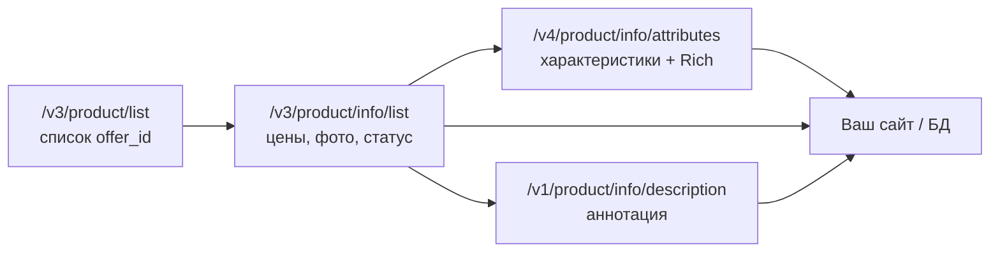

# Выгрузка карточек товара из Ozon в сайт магазина

Документ для **отдельного проекта** (интернет-магазин, CMS, WordPress и т.п.): как получить данные карточек из кабинета продавца Ozon через **Seller API** и разместить их на своём сайте.

Официальная документация Ozon: [docs.ozon.ru/api/seller](https://docs.ozon.ru/api/seller/)

Проверенные примеры запросов — из репозитория [ozon-mebel](https://github.com/AndreyNF/ozon-mebel) (`scripts/ozon_client.py`, `scripts/ozon_api_product_status.py`).

---

## 1. Что можно получить для карточки на сайте

| Блок сайта | Источник в Ozon API | Примечание |
|------------|---------------------|------------|
| Название | `/v3/product/info/list` → `name` | То же, что на витрине Ozon |
| Артикул продавца | `offer_id` | Ваш SKU в кабинете |
| Ozon SKU | `sku` | Числовой идентификатор Ozon |
| Цена / старая цена | `price`, `old_price` | Строки, валюта в `currency_code` |
| Главное фото + галерея | `primary_image[]`, `images[]` | CDN Ozon (`ir.ozone.ru`, `cdn1.ozone.ru`) |
| Краткое описание (аннотация) | `/v1/product/info/description` или атрибут **4191** | Plain text, до ~500 символов |
| Rich-контент (блоки, галерея в описании) | атрибут **11254** (`Rich-контент JSON`) | JSON v0.3, см. [песочницу Ozon](https://rich-content.ozon.ru/sandbox) |
| Характеристики (бренд, размеры, материал…) | `/v4/product/info/attributes` → `attributes[]` | `attribute_id` + `value` / `dictionary_value_id` |
| Габариты / вес | attributes или поля `height`, `width`, `depth`, `weight` | Единицы: `dimension_unit`, `weight_unit` |
| Наличие | `stocks.has_stock`, `availabilities[]` | Для FBS — отдельно `/v2/products/stocks` (запись) |
| Статус модерации | `statuses.validation_status`, `statuses.status_name` | Фильтровать «Готов к продаже» |
| Видеообложка | атрибут **21845** | URL MP4 (если заполнено в карточке) |
| Хештеги | атрибут **23171** | SEO на Ozon |

**Не отдаёт API напрямую:** отзывы, рейтинг, SEO-URL витрины Ozon, комиссии (есть в `info/list`, но для сайта обычно не нужны).

---

## 2. Ключи API

1. [seller.ozon.ru](https://seller.ozon.ru) → **Настройки** → **Seller API** → **API-ключи**.
2. Создайте ключ с правами на **товары** и **цены** (чтение достаточно для выгрузки).
3. Сохраните:
   - **Client-Id** — идентификатор продавца
   - **Api-Key** — секретный ключ

Переменные окружения (рекомендуемые имена):

```bash
OZON_CLIENT_ID=123456
OZON_API_KEY=xxxxxxxx-xxxx-xxxx-xxxx-xxxxxxxxxxxx
```

---

## 3. Базовые параметры запросов

- **Базовый URL:** `https://api-seller.ozon.ru`
- **Метод:** почти все методы — `POST`
- **Заголовки (обязательно):**

```http
Client-Id: {OZON_CLIENT_ID}
Api-Key: {OZON_API_KEY}
Content-Type: application/json
```

---

## 4. Схема синхронизации каталога



**Рекомендуемый порядок:**

1. Получить список всех `offer_id` (с пагинацией).
2. Пакетами по 100–1000 штук запросить `info/list` (цены, медиа, статус).
3. Для карточек на сайт — `info/description` и/или `info/attributes`.
4. Сохранить в БД, отдать фронту; медиа — по URL Ozon или скачать на свой CDN.

---

## 5. Список товаров в кабинете

**`POST /v3/product/list`**

Возвращает `product_id`, `offer_id`, флаги архива. До **1000** позиций за запрос, дальше — `last_id`.

```bash
curl -s -X POST 'https://api-seller.ozon.ru/v3/product/list' \
  -H "Client-Id: $OZON_CLIENT_ID" \
  -H "Api-Key: $OZON_API_KEY" \
  -H "Content-Type: application/json" \
  -d '{
    "filter": {
      "visibility": "VISIBLE"
    },
    "limit": 100,
    "last_id": "",
    "sort_by": "product_id",
    "sort_dir": "ASC"
  }'
```

Значения `filter.visibility` (типичные):

| Значение | Смысл |
|----------|--------|
| `ALL` | Все товары |
| `VISIBLE` | Видимые покупателям |
| `INVISIBLE` | Скрытые |
| `ARCHIVED` | В архиве |

**Пагинация:** пока в ответе есть `result.last_id`, повторяйте запрос с этим `last_id`.

Пример ответа (сокращённо):

```json
{
  "result": {
    "items": [
      {
        "product_id": 4719196784,
        "offer_id": "Ц0011713"
      }
    ],
    "total": 42,
    "last_id": "4719196784"
  }
}
```

---

## 6. Основные данные карточки (цены, фото, статус)

**`POST /v3/product/info/list`**

Поиск по `offer_id`, `product_id` или `sku`. В ozon-mebel передаётся массив `offer_id` на верхнем уровне тела запроса:

```bash
curl -s -X POST 'https://api-seller.ozon.ru/v3/product/info/list' \
  -H "Client-Id: $OZON_CLIENT_ID" \
  -H "Api-Key: $OZON_API_KEY" \
  -H "Content-Type: application/json" \
  -d '{"offer_id": ["Ц0011713", "Ц0023320"]}'
```

Поля для сайта (фрагмент реального ответа):

```json
{
  "items": [
    {
      "id": 4719196784,
      "offer_id": "Ц0011713",
      "sku": 4418139283,
      "name": "Кровать Террикон Киви №4 80x160 см…",
      "price": "18990.00",
      "old_price": "21990.00",
      "currency_code": "RUB",
      "primary_image": ["https://ir.ozone.ru/s3/multimedia-1-l/10737981777.jpg"],
      "images": ["https://ir.ozone.ru/s3/…"],
      "description_category_id": 17027917,
      "type_id": 970713329,
      "stocks": { "has_stock": true },
      "statuses": {
        "status_name": "Готов к продаже",
        "validation_status": "success",
        "moderate_status": "approved"
      }
    }
  ]
}
```

**Для карточки на сайте:**

- `name` → заголовок H1
- `primary_image[0]` → главное фото
- `images[]` → галерея (без дублей с primary)
- `price` / `old_price` → цена и зачёркнутая «старая»
- `stocks.has_stock` → «В наличии» / «Под заказ»
- фильтр: `validation_status == "success"` и нужный `status_name`

---

## 7. Текстовое описание (аннотация)

**`POST /v1/product/info/description`**

```bash
curl -s -X POST 'https://api-seller.ozon.ru/v1/product/info/description' \
  -H "Client-Id: $OZON_CLIENT_ID" \
  -H "Api-Key: $OZON_API_KEY" \
  -H "Content-Type: application/json" \
  -d '{"offer_id": "Ц0011713", "product_id": 4719196784}'
```

Ответ:

```json
{
  "result": {
    "id": 4719196784,
    "offer_id": "Ц0011713",
    "name": "…",
    "description": "Кровать Террикон Киви №4 односпальная 80x160 см…"
  }
}
```

Поле `description` — готовый текст для блока «Описание» на сайте (аналог колонки «Аннотация» в Excel-шаблоне Ozon).

---

## 8. Характеристики и Rich-контент

**`POST /v4/product/info/attributes`**

Полная карточка с атрибутами, габаритами и медиа в одном ответе. Поддерживает фильтр и пагинацию.

```bash
curl -s -X POST 'https://api-seller.ozon.ru/v4/product/info/attributes' \
  -H "Client-Id: $OZON_CLIENT_ID" \
  -H "Api-Key: $OZON_API_KEY" \
  -H "Content-Type: application/json" \
  -d '{
    "filter": {
      "offer_id": ["Ц0011713"],
      "visibility": "ALL"
    },
    "limit": 100,
    "sort_dir": "ASC"
  }'
```

В `result[]` для каждого товара:

- `attributes[]` — массив `{ attribute_id, values: [{ value, dictionary_value_id }] }`
- `height`, `width`, `depth`, `weight` — упаковка/габариты
- `images[]` — фото с полем `file_name` (URL)

### Частые ID атрибутов (мебель и общие)

| ID | Название в ЛК Ozon | Использование на сайте |
|----|--------------------|-------------------------|
| 85 | Бренд | `brand` |
| 4180 | Название | дублирует `name`, редко нужно |
| 4191 | Аннотация | краткое описание |
| 9048 | Название модели | группировка вариантов |
| 10096 | Цвет товара | фильтр / свойство |
| 10097 | Название цвета | отображаемый цвет |
| 10174–10176 | Высота / Ширина / Глубина, см | таблица характеристик |
| 11254 | Rich-контент JSON | блоки описания (см. ниже) |
| 21845 | Озон.Видеообложка: ссылка | `<video>` на карточке |
| 23171 | #Хештеги | meta / теги |

Справочник имён атрибутов **по категории** (для подписей на сайте):

**`POST /v1/description-category/attribute`** — параметры `description_category_id`, `type_id`, `language: "RU"`.

---

## 9. Rich-контент на сайте

Атрибут **11254** содержит JSON формата **v0.3**, например:

```json
{
  "version": 0.3,
  "content": [
    {
      "widgetName": "raTextBlock",
      "title": { "content": ["Заголовок"], "size": "size4" },
      "text": { "content": ["Абзац текста"], "size": "size2" }
    },
    {
      "widgetName": "raShowcase",
      "type": "billboard",
      "blocks": [{ "img": { "src": "https://…" }, "title": {…}, "text": {…} }]
    }
  ]
}
```

**Варианты для сайта:**

1. **Парсить JSON** — рендерить те же виджеты (`raTextBlock`, `raShowcase` billboard/chess/roll).
2. **Упростить** — вытащить только `text.content` и `img.src` в HTML.
3. **Не использовать** — достаточно `description` + таблицы атрибутов.

Спецификация: [docs/ozon-rich-content.md](./ozon-rich-content.md) (из ozon-mebel), песочница: [rich-content.ozon.ru/sandbox](https://rich-content.ozon.ru/sandbox).

---

## 10. Маппинг «Ozon → карточка сайта»

Пример структуры записи в БД / CMS:

```json
{
  "slug": "krovat-kivi-4-80x160",
  "sku": "Ц0011713",
  "ozon_product_id": 4719196784,
  "ozon_sku": 4418139283,
  "title": "Кровать Террикон Киви №4 80x160 см…",
  "price": 18990,
  "price_old": 21990,
  "currency": "RUB",
  "in_stock": true,
  "main_image": "https://ir.ozone.ru/s3/…",
  "gallery": ["https://ir.ozone.ru/s3/…"],
  "short_description": "…",
  "rich_content": { "version": 0.3, "content": [] },
  "attributes": [
    { "name": "Бренд", "value": "Террикон" },
    { "name": "Ширина, см", "value": "80" }
  ],
  "video_url": null,
  "source": "ozon",
  "synced_at": "2026-06-12T12:00:00Z"
}
```

`slug` API не отдаёт — генерируйте из `name` или используйте `offer_id`.

---

## 11. Минимальный клиент на Python (stdlib)

Скопируйте в другой проект; зависимостей кроме Python 3.10+ не нужно.

```python
#!/usr/bin/env python3
"""Пример: одна карточка Ozon → dict для сайта."""

import json
import os
import urllib.request

BASE = "https://api-seller.ozon.ru"

# Частые атрибуты → человекочитаемые ключи
ATTR_LABELS = {
    85: "Бренд",
    4191: "Аннотация",
    10096: "Цвет",
    10174: "Высота, см",
    10175: "Ширина, см",
    10176: "Глубина, см",
    11254: "Rich-контент JSON",
    21845: "Видеообложка",
}


def ozon_post(path: str, body: dict) -> dict:
    req = urllib.request.Request(
        f"{BASE}{path}",
        data=json.dumps(body).encode(),
        method="POST",
        headers={
            "Client-Id": os.environ["OZON_CLIENT_ID"],
            "Api-Key": os.environ["OZON_API_KEY"],
            "Content-Type": "application/json",
        },
    )
    with urllib.request.urlopen(req, timeout=120) as resp:
        return json.loads(resp.read())


def fetch_product_for_website(offer_id: str) -> dict:
    info = ozon_post("/v3/product/info/list", {"offer_id": [offer_id]})
    items = info.get("items") or []
    if not items:
        raise ValueError(f"offer_id {offer_id} not found")
    item = items[0]
    product_id = item["id"]

    desc = ozon_post(
        "/v1/product/info/description",
        {"offer_id": offer_id, "product_id": product_id},
    )
    attrs_resp = ozon_post(
        "/v4/product/info/attributes",
        {"filter": {"offer_id": [offer_id], "visibility": "ALL"}, "limit": 1},
    )
    attr_row = (attrs_resp.get("result") or [{}])[0]
    raw_attrs = {a["attribute_id"]: a for a in attr_row.get("attributes") or []}

    rich = None
    if 11254 in raw_attrs:
        try:
            rich = json.loads(raw_attrs[11254]["values"][0]["value"])
        except (json.JSONDecodeError, KeyError, IndexError):
            pass

    return {
        "offer_id": offer_id,
        "ozon_product_id": product_id,
        "ozon_sku": item.get("sku"),
        "title": item.get("name"),
        "price": float(item.get("price") or 0),
        "price_old": float(item.get("old_price") or 0) or None,
        "currency": item.get("currency_code", "RUB"),
        "in_stock": (item.get("stocks") or {}).get("has_stock", False),
        "main_image": (item.get("primary_image") or [None])[0],
        "gallery": item.get("images") or [],
        "short_description": (desc.get("result") or {}).get("description"),
        "rich_content": rich,
        "attributes": [
            {
                "id": aid,
                "name": ATTR_LABELS.get(aid, str(aid)),
                "value": v["values"][0]["value"],
            }
            for aid, v in raw_attrs.items()
            if aid not in (11254,) and v.get("values")
        ],
        "video_url": (
            raw_attrs.get(21845, {}).get("values", [{}])[0].get("value")
            if 21845 in raw_attrs
            else None
        ),
    }


if __name__ == "__main__":
    import sys
    print(json.dumps(fetch_product_for_website(sys.argv[1]), ensure_ascii=False, indent=2))
```

Запуск:

```bash
export OZON_CLIENT_ID=… OZON_API_KEY=…
python3 ozon_fetch_product.py Ц0011713
```

В репозитории ozon-mebel аналог read-only шага: `python3 scripts/ozon_api_product_status.py {offer_id}` → файл `ozon-live-status_*.json` (без attributes/Rich).

---

## 12. Изображения на сайте

- URL из API ведут на CDN Ozon (`ir.ozone.ru`, `cdn1.ozone.ru`).
- **Можно** использовать напрямую в `` — быстрый старт.
- **Лучше для продакшена:** периодически скачивать на свой S3/CDN (стабильность, контроль кэша, не зависеть от политики Ozon).
- При обновлении фото в кабинете URL меняются — нужен повторный sync.

---

## 13. Остатки и цены

| Задача | Метод |
|--------|--------|
| Прочитать наличие (упрощённо) | `stocks` в `/v3/product/info/list` |
| Обновить цену | `/v1/product/import/prices` или import |
| Выставить FBS-остаток | `/v2/products/stocks` (см. ozon-mebel `ozon_api_stocks.py`) |

Для **витрины сайта** обычно достаточно периодически опрашивать `info/list`; частота — от 15 мин до 1 ч в зависимости от оборота.

---

## 14. Ограничения и типичные ошибки

1. **Лимиты запросов** — при большом каталоге делайте паузы между пакетами; обрабатывайте HTTP 429.
2. **Версии методов** — Ozon периодически добавляет `/v4/…`; сверяйтесь с [актуальной документацией](https://docs.ozon.ru/api/seller/).
3. **`/v3/product/info/list`** — в разных SDK тело запроса может отличаться (`offer_id` на верхнем уровне vs `filter`); при 400 пробуйте формат из официальной доки.
4. **Rich и видео** — только через attributes; `info/description` их не вернёт.
5. **Словарные атрибуты** — в ответе есть `dictionary_value_id`; для сайта показывайте поле `value`.
6. **Товары «Не продаётся»** — часто `has_stock: false`; на сайте можно скрывать или показывать «под заказ».
7. **Query-string в URL медиа** — для загрузки в Ozon видео **без** `?v=`; для своего CDN cache-bust допустим.

---

## 15. Альтернатива API: Excel из личного кабинета

Если карточек мало и автоматизация не нужна:

1. ЛК Ozon → **Товары** → **Список товаров** → **Скачать** (шаблон категории).
2. В xlsx есть название, цена, фото (ссылки), аннотация, характеристики.
3. Импорт в CMS вручную или через парсер xlsx.

Минус: нет автосинхронизации цен и остатков; Rich JSON в Excel может быть обрезан.

---

## 16. Рекомендуемая архитектура для сайта

```
┌─────────────┐     cron / webhook      ┌──────────────┐
│ Ozon API    │ ───────────────────────►│ Sync service │
└─────────────┘                         └──────┬───────┘
                                               │
                                               ▼
                                        ┌──────────────┐
                                        │ PostgreSQL / │
                                        │ WordPress CPT│
                                        └──────┬───────┘
                                               │
                                               ▼
                                        ┌──────────────┐
                                        │ Storefront   │
                                        └──────────────┘
```

- **Полный sync** — раз в сутки (`product/list` + attributes).
- **Быстрый sync** — каждые N минут только `info/list` для цен/остатков.
- **Кэш** — Redis или CDN для картинок.
- **Idempotency** — ключ записи `offer_id` или `ozon_product_id`.

---

## 17. Связь с репозиторием ozon-mebel

| Файл | Назначение |
|------|------------|
| `scripts/ozon_client.py` | HTTP-клиент, загрузка `.env` |
| `scripts/ozon_api_product_status.py` | `info/list` + `info/description` → JSON |
| `scripts/ozon_sync_import_payload.py` | Маппинг полей Excel → ID атрибутов (для **загрузки** в Ozon) |
| `docs/ozon-rich-content.md` | Формат Rich v0.3 |
| `cards/*/ozon-live-status_*.json` | Примеры живых ответов API |

Для **сайта** используйте read-методы (разделы 5–8); скрипты import/sync в ozon-mebel — для **выгрузки в Ozon**, а не с него.

---

## 18. Чеклист перед запуском на сайте

- [ ] API-ключ с правами на чтение товаров
- [ ] Тест на 1–2 `offer_id`: цены, фото, описание, attributes
- [ ] Решение по Rich: парсить JSON или только plain description
- [ ] Политика по товарам без остатка / без модерации
- [ ] План sync (cron) и лог ошибок API
- [ ] Копирование изображений на свой хостинг (опционально)
